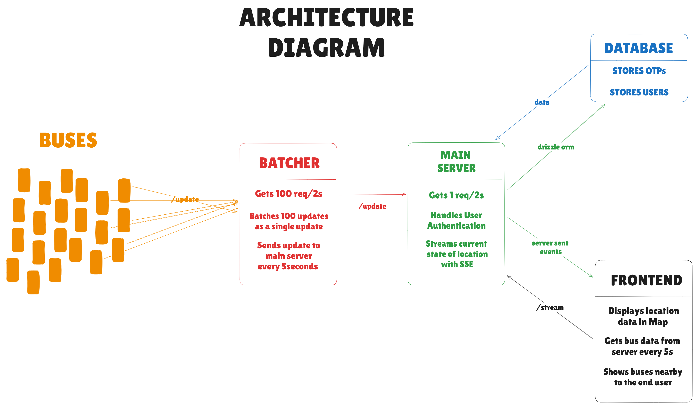

# Saveetha Transport Tracker - Polaris

Saveetha Transport Tracker is a web application that helps students track college buses in real-time on a map.

**Think of it like the Chalo app for Saveetha buses.**

Students can see exactly where their morning bus is while getting ready to board, so they know precisely when to leave their house, and avoid unnecessary waiting. It also ensures that the student is not waiting for a bus that has already left.

### Key Features:

- **See all buses on a map** — Live locations update automatically every few seconds
- **Know when to leave** — See if your bus is nearby or still far away
- **Find buses near you** — The app shows which buses are closest to your current location
- **Works on any device** — Phone, tablet, laptop — just open it in your browser

### The Problem We Solved

**Before this system existed:**
- Students had no idea when their bus would arrive
- They either waited too long or missed buses completely
- No way to know if a bus was delayed or already left
- The transportation office had no efficient way to track the fleet

**After this system:**
- Students see live bus locations on their phone/computer
- Real-time updates every few seconds
- Can plan their schedule better and avoid unnecessary waiting

---

## How It Works (Simple Version)

### For You (The Student)

1. **Sign Up** — Enter your email (must be pre-approved by admin) and get a 6-digit verification code
2. **Verify** — Enter the code sent to your email and set a password
3. **Login & Track** — Open the map and watch buses move in real-time!

### Behind the Scenes

- Buses (or bus tracking devices) send their GPS location every few seconds
- The server collects these locations and broadcasts them to all connected students
- Your browser receives updates automatically and the map refreshes — no need to manually reload!

---

## Architecture Overview

The system consists of five main components working together:



| Component | What It Does |
|-----------|--------------|
| **Frontend** | The website students see — map, login page, and UI |
| **Backend** | Main server handling authentication, user data, and streaming bus locations |
| **Batcher** | Helper service that collects many small GPS updates and batches them together |
| **Simulation** | Testing tool that creates 100 fake buses moving around Chennai |
| **Database** | SQLite database for storing user data and OTPs |

---

## Technical Decisions (The "Why" Behind Our Stack)

Every technology choice was made deliberately to optimize for performance, cost, and maintainability. Here's the reasoning:

### 1. Runtime: Bun instead of Node.js

**The Choice:** We use [Bun](https://bun.sh) as our JavaScript runtime instead of Node.js or Express.js.

**The Reason:**
- **Performance:** Bun handles **52,000+ requests per second** with Express-style APIs, compared to Node.js/Express at **13,000 req/s** — that's **4x faster HTTP throughput**.
  - Other benchmarks show Bun at **65,000 req/s** vs Node.js at **22,000 req/s** (3x faster), with **38% less memory usage**.
  - For a real-time tracking app where every millisecond of latency matters, this is crucial. Students see bus updates faster.
- **All-in-One:** Bun includes everything we need out of the box:
  - Package manager (like npm, but faster)
  - Test runner
  - TypeScript support (no build config needed)
  - Bundler
- **Modern Design:** Built from the ground up for modern JavaScript/TypeScript, not carrying legacy baggage from the 2009 Node.js era.

### 2. Real-Time Updates: Server-Sent Events (SSE) instead of WebSockets

**The Choice:** We use **Server-Sent Events (SSE)** to push bus locations to students' browsers.

**The Reason:**

**Why not WebSockets?**
- WebSockets are bidirectional — they're designed for chat apps where both client and server send messages back and forth.
- In our case, data flows only ONE way: Server → Student. Students don't need to send location data back.
- WebSockets add unnecessary complexity for our use case.

**Why SSE is perfect here:**
- **Unidirectional Broadcast:** SSE is designed exactly for "server pushes data to many clients" scenarios.
- **Automatic Reconnection:** If a student's phone loses WiFi signal (walking between buildings), SSE automatically reconnects when signal returns. With WebSockets, you'd have to code this manually.
- **Firewall Friendly:** Works over standard HTTP. College WiFi networks sometimes block WebSocket connections, but SSE just works.
- **Built Into Browsers:** Modern browsers have native `EventSource` API. No external libraries needed.
- **Efficient:** Uses a single long-lived HTTP connection. Very lightweight (~10KB memory per connection).

### 3. Database: SQLite with Drizzle ORM

**The Choice:** We use [SQLite](https://www.sqlite.org/) for storage, managed by [Drizzle ORM](https://orm.drizzle.team).

**The Reason:**

**Why SQLite? (Most people assume you need PostgreSQL/MySQL)**
- **Speed:** For a college transport system (thousands of users, not millions), SQLite is actually **faster** than PostgreSQL/MySQL. Why?
  - SQLite lives inside the application (embedded database) — zero network latency
  - PostgreSQL requires network round-trips for every query, even if it's on the same server
- **Simplicity:** 
  - No database server to install, configure, or maintain
  - The entire database is one file (`transport.db`)
  - Backup = copy one file
- **Reliability:** SQLite is used in airplanes, military systems, and every Android/iOS phone. It's battle-tested.
- **Performance Numbers:** SQLite handles tens of thousands of reads per second on basic hardware. Our app has maybe 100-200 concurrent users at peak — SQLite won't even break a sweat.

**When would we need PostgreSQL?**
- If we scale to 50,000+ simultaneous users
- If we need complex analytics or reporting
- If we need replication across multiple servers

For now, SQLite is the perfect choice.

**Why Drizzle ORM?**
- **Type Safety:** Drizzle gives us full TypeScript autocomplete and type checking. We can't accidentally query wrong columns or insert invalid data.
- **Performance:** Traditional ORMs like Prisma add runtime overhead. Drizzle is "zero overhead" — it compiles to raw SQL.
- **SQL-Like Syntax:** Unlike Prisma's custom query language, Drizzle feels like writing SQL. Developers who know SQL can be productive immediately.
- **Lightweight:** Prisma is ~20MB. Drizzle is ~200KB. Smaller bundle = faster app startup.

**Example:**
```typescript
// Drizzle query (readable, type-safe)
const user = await db.select()
  .from(users)
  .where(eq(users.email, 'student@saveetha.in'))
  .limit(1);

// TypeScript knows user.email exists and is a string ✅
```

### 4. High Traffic Handling: The Batcher Service

**The Choice:** A dedicated microservice (`/batcher`) buffers GPS updates before sending them to the main server.

**The Problem:**
- Imagine 100 buses individually sending GPS coordinates every 2 seconds (100 requests / 2 seconds)
- Those requests hit the main server, which must process each one individually
- This creates unnecessary load on the main server

**The Solution:**
- GPS tracking devices send lightweight **text data** to the Batcher: `"1,13.0827,80.2707,1704067200000"`
  - Format: `busId,latitude,longitude,timestamp`
  - Plain text = minimal bandwidth
- The Batcher **collects these in memory (RAM)** for 5 seconds
- Every 5 seconds, it batches all updates into **one JSON array** and sends them to the main server

**Example:**
```javascript
// Instead of 100 separate requests:
POST /update { id: 1, lat: 13.08, lng: 80.27, timestamp: 123 }
POST /update { id: 2, lat: 13.09, lng: 80.28, timestamp: 124 }
// ... (98 more requests)

// We send ONE batch:
POST /update [
  { id: 1, lat: 13.08, lng: 80.27, timestamp: 123 },
  { id: 2, lat: 13.09, lng: 80.28, timestamp: 124 },
  // ... all 100 buses at once
]
```

**Benefits:**
- **99% fewer HTTP requests** to the main server
- Main server can process updates more efficiently (one batch vs many individual requests)
- If the main server goes down temporarily, the Batcher queues updates in memory and retries

### 5. Location Storage: In-Memory Map instead of Redis

**The Choice:** We store bus locations in a JavaScript `Map` object in the server's RAM instead of using Redis.

**The Reason:** Redis is unnecessary here.

- **Overkill for Scale:** We're tracking ~100 buses. A `Map` with 100 entries uses ~10KB RAM. Redis adds complexity for no benefit.
- **Ephemeral Data:** Bus locations are temporary — we only care about the *current* position. If the server restarts, buses send fresh updates within seconds. No need to persist.
- **Simpler Deployment:** No external service to install, configure, or monitor.

**When would we need Redis?**
- Multiple server instances (horizontal scaling) — Redis would act as shared state
- Location history/analytics
- Pub/sub across services

### 6. Map Rendering: MapLibre GL instead of Google Maps

**The Choice:** We use [MapLibre GL](https://maplibre.org) for rendering the map.

**The Reason:**

**Why not Google Maps?**
- **Cost:** Google Maps charges per API call. For thousands of students checking the map daily, this would cost hundreds of dollars per month.
- **Restrictions:** Google limits map style customization.

**Why MapLibre:**
- **Cost:** Completely free. We use **OpenFreeMap** for vector tiles (open-source map data).
- **Performance:** 
  - Uses **WebGL** (GPU rendering) for buttery smooth 60fps animations
  - Even cheap Android phones can zoom/pan without lag
  - Traditional raster maps (like old Google Maps) load as images and get pixelated when you zoom
  - Vector maps stay crisp at any zoom level
- **Customization:** Full control over colors, fonts, icons. We can match the map to our brand/theme.
- **Privacy:** No tracking. Google Maps tracks user locations. MapLibre sends zero analytics.

### 7. Frontend: React 19 + Vite + TailwindCSS 4

**The Choices:**
- **React 19:** Latest version with improved performance (automatic batching, concurrent rendering)
- **Vite 7:** Ultra-fast dev server and build tool (starts in milliseconds vs Webpack's seconds)
- **TailwindCSS 4:** Utility-first CSS framework — faster development, smaller bundle size

**The Reason:**
- **React:** Industry standard, huge ecosystem, proven for real-time apps
- **Vite:** Development experience matters. With Vite, code changes appear instantly in the browser (Hot Module Replacement). No waiting for builds.
- **TailwindCSS 4:** Write styles directly in JSX without switching files. The new v4 engine is 10x faster than v3.

### 8. Authentication: JWT Cookies + OTP Email Verification

**The Choice:** 
- Email verification with 6-digit OTP
- Session management with JWT cookies

**The Reason:**
- **Security:**
  - Passwords hashed with **Argon2id** (OWASP recommended algorithm)
  - OTPs hashed before storage (even if database leaks, OTPs are useless)
  - JWT cookies with `HttpOnly` flag (JavaScript can't access them = prevents XSS attacks)
  - `SameSite=Strict` (prevents CSRF attacks)
- **Stateless Sessions:** 
  - JWT contains user data (id, email, username)
  - No database lookup needed to verify identity on each request
  - Server can handle thousands of concurrent authenticated users with minimal overhead
- **Email Allowlist:** Only pre-approved emails can register (admin controls access)

---

## Project Structure Explained

```
transport-app/
├── backend/                    # Main API Server (Bun + TypeScript)
│   ├── controllers/            # Handle HTTP requests
│   │   ├── authController.ts       # /auth/* endpoints (login, register, OTP)
│   │   ├── locationController.ts   # /stream (SSE) and /update (bus locations)
│   │   └── mainController.ts       # Serve static files
│   ├── services/               # Business logic (pure functions)
│   │   ├── userService.ts          # User CRUD operations
│   │   ├── otpService.ts           # OTP generation + verification
│   │   ├── cookieService.ts        # JWT creation + validation
│   │   └── corsService.ts          # CORS headers
│   ├── models/                 # Database schemas (Drizzle)
│   │   ├── user.ts                 # users table
│   │   └── otp.ts                  # otps table
│   ├── routes/                 
│   │   ├── authRoutes.ts           # Auth endpoint definitions
│   │   └── locationRoutes.ts       # Location streaming endpoints
│   ├── middleware/             
│   │   └── rateLimiter.ts          # 5 req/min limit on auth endpoints
│   ├── jobs/                   
│   │   └── otpCleanup.ts           # Background job: delete expired OTPs
│   ├── utils/                  
│   │   ├── sendOtp.ts              # Email sending (nodemailer)
│   │   └── validations.ts          # Input validation helpers
│   ├── db/                     
│   │   └── db.ts                   # SQLite connection
│   └── server.ts               # Entry point
│
├── frontend/                   # React 19 SPA (Vite + TailwindCSS 4)
│   └── src/
│       ├── pages/              
│       │   ├── Home.tsx            # Main map view (protected route)
│       │   ├── Login.tsx           # Login form
│       │   └── Signup.tsx          # Registration with OTP
│       ├── components/         
│       │   ├── MapComponent.tsx    # MapLibre integration
│       │   ├── BusMarker.tsx       # Custom bus icons on map
│       │   ├── Header.tsx          # Navigation bar
│       │   ├── Drawer.tsx          # Bottom sheet showing nearby buses
│       │   └── guards/             # ProtectedRoute, PublicRoute
│       ├── hooks/              # Custom React hooks
│       │   ├── useLocationStream.ts    # SSE connection + state
│       │   └── useNearbyBuses.ts       # Geolocation + distance calc
│       └── context/            
│           ├── AuthContext.tsx     # Global auth state
│           └── ThemeContext.tsx    # Dark/light theme
│
├── batcher/                    # Update Aggregation Microservice
│   └── index.ts                # Buffers text updates → batches to JSON
│
├── simulation/                 # Development Testing Tool
│   └── sim.ts                  # Simulates 100 buses around Chennai
│
├── types/                      # Shared TypeScript definitions
│   └── index.d.ts              # BusDetails, BusText types
│
├── API_DOCUMENTATION.md        # Full API reference
├── BATCHER.md                  # Batcher service docs
└── README.md                   # This file
```

---

## Authentication Flow (Detailed)

### Registration Process

1. **Student enters email** → Frontend sends `POST /auth/send-otp`
2. **Server checks** if email exists in `valid_emails` allowlist (admin pre-approved)
3. **If approved:**
   - Server generates random 6-digit OTP: `randomInt(100000, 999999)`
   - Hashes OTP with Argon2id: `await Bun.password.hash(otp)`
   - Stores hashed OTP in database with 10-minute expiry
   - Sends plain OTP to email via nodemailer
4. **Student enters OTP + password** → `POST /auth/register`
5. **Server verifies:**
   - OTP matches hash: `await Bun.password.verify(inputOtp, storedHash)`
   - If valid, deletes OTP record (one-time use)
   - Hashes password with Argon2id
   - Creates user in database
   - Generates JWT session cookie
6. **Student is logged in** → Can access `/` (map page)

### Login Process

1. **Student enters email + password** → `POST /auth/login`
2. **Server:**
   - Finds user by email
   - Verifies password: `await Bun.password.verify(inputPassword, user.passwordHash)`
   - If valid, generates JWT cookie with 7-day expiry
3. **Subsequent requests:**
   - Browser automatically sends cookie
   - Server decodes JWT to get user identity (no database lookup)

### Security Features

- **Rate Limiting:** 5 attempts/minute per IP (prevents brute force)
- **HttpOnly Cookies:** JavaScript cannot read session tokens (XSS protection)
- **SameSite Cookies:** Prevents CSRF attacks
- **Argon2id Hashing:** OWASP-recommended algorithm (resistant to GPU cracking)
- **OTP Expiry:** Auto-delete after 10 minutes (background job runs every hour)

---

## Real-Time Data Flow (How Bus Updates Work)

### Timestamp-Based Conflict Resolution

**The Problem:**
Network delays can cause updates to arrive out of order.

Example:
- Bus sends update at 12:00:01 (timestamp T1)
- Bus sends update at 12:00:02 (timestamp T2)
- Due to network lag, T2 arrives at server before T1

If we blindly accept all updates, the bus would "jump backwards" on the map.

**The Solution:**
Only accept updates with newer timestamps:

```typescript
// locationController.ts
const prev = busLocations.get(bus.id);
if (!prev || bus.timestamp > prev.timestamp) {
  busLocations.set(bus.id, bus); // Update accepted
} else {
  // Ignore old update
}
```

### SSE Broadcasting Mechanism

1. **Student opens map** → Browser connects to `GET /stream`
2. **Server creates SSE stream** and adds student to `controllers` Set
3. **Every 5 seconds** (configurable via `INTERVAL` env):
   - Server reads all bus locations from in-memory Map
   - Converts to JSON array: `[{id:1, lat:13.08, lng:80.27, timestamp:123}, ...]`
   - Broadcasts to **all connected students** simultaneously
4. **Student's browser** receives event and updates the map (React state)
5. **If connection drops** (phone loses WiFi):
   - Browser's `EventSource` fires `onerror`
   - Automatically reconnects when WiFi returns
   - Server removes dead connection from `controllers` Set

### Memory Efficiency

- Each SSE connection: **~10KB RAM**
- 1000 concurrent students: **~10MB RAM total**
- Bus locations stored in-memory Map (not database) for instant access
- No disk I/O for location updates = maximum speed

---

## Database Schema

### Users Table
```sql
CREATE TABLE users (
  id INTEGER PRIMARY KEY AUTOINCREMENT,
  username TEXT NOT NULL,
  email TEXT NOT NULL UNIQUE,
  password_hash TEXT NOT NULL,
  created_at TEXT DEFAULT (datetime('now'))
);
```

### OTPs Table
```sql
CREATE TABLE otps (
  id INTEGER PRIMARY KEY AUTOINCREMENT,
  email TEXT NOT NULL,
  otp_hash TEXT NOT NULL,
  created_at TEXT DEFAULT (datetime('now'))
);
```

**Note:** Location data is **not** stored in the database. It lives in RAM (in-memory Map) for performance. Historical tracking would require a separate `bus_locations` table.

---

## Shared TypeScript Types

```typescript
// types/index.d.ts

// Full bus details (JSON format sent to frontend)
export type BusDetails = {
  id: number;        // Bus identifier
  lat: number;       // Latitude
  lng: number;       // Longitude
  timestamp: number; // Unix timestamp (milliseconds)
};

// Lightweight text format (sent from GPS devices to Batcher)
export type BusText = `${number},${number},${number},${number}`;
// Example: "1,13.0827,80.2707,1704067200000"
```

---


## Environment Variables

### Backend (`backend/.env`)
```env
SERVER_PORT=3000
SECRET_KEY=your-super-secret-jwt-key-here
SESSION_MAX_AGE=604800          # 7 days in seconds
INTERVAL=5000                   # SSE broadcast interval (ms)

# Email Configuration
SMTP_HOST=smtp.gmail.com
SMTP_PORT=587
SMTP_USER=your-email@gmail.com
SMTP_PASS=your-app-password
```

### Frontend (`frontend/.env`)
```env
VITE_API_URL=http://localhost:3000
```

### Batcher (`batcher/.env`)
```env
BATCHER_PORT=4000
TARGET_URL=http://localhost:3000/update
INTERVAL=5000                   # Batch flush interval (ms)
```

---

## Additional Documentation

- [API_DOCUMENTATION.md](./API_DOCUMENTATION.md) — Complete endpoint reference with request/response examples
- [BATCHER.md](./BATCHER.md) — Deep dive into the batching service architecture

---

## Built By

**Sec TechSociety** — A real-time tracking solution for Saveetha Engineering College.

## License

This project is licensed under the MIT License. See [LICENSE](./LICENSE) for details.
